# scp-plot

**SCP's plotting grammar, for scanpy.**

A port of the plotting layer of the R package
[SCP](https://github.com/zhanghao-njmu/SCP) (Hao Zhang, Nanjing Medical
University, GPL-3) — 229 curated palettes, a consistent theme, and ~30 figure
functions — reading **AnnData** directly instead of Seurat.

scanpy's plotting is deliberately minimal. SCP's is not: it has a coherent
grammar for grouping, splitting, faceting, labelling and legend composition that
carries across every figure type, and the results are publication-ready without
post-processing. That grammar is worth having in Python, but it is locked behind
Seurat and 14,794 lines of R.

## Install

```bash
pip install -e ".[dev]"
```

Core deps are anndata, matplotlib, numpy, pandas, scipy. Everything heavier is an
extra: `[gam]`, `[graph]`, `[enrich]`, `[velocity]`, `[interactive]`, `[raster]`,
`[fuzzy]`, or `[all]`. A function that needs one imports it lazily and tells you
which extra to install.

## Quick start

- [Dimensional reduction](#dimensional-reduction)
- [Heatmaps](#heatmaps)
- [Expression distributions](#expression-distributions)
- [Cell composition](#cell-composition)
- [Differential expression](#differential-expression)
- [Correlation](#correlation)
- [Trajectory](#trajectory)
- [Enrichment](#enrichment)
- [Palettes and themes](#palettes-and-themes)

Every figure below is generated by `tools/make_readme_figures.py` from the code
shown beside it, on `pancreas_sub` — the mouse pancreatic endocrinogenesis
dataset SCP itself develops against ([Bastidas-Ponce et al.
2019](https://doi.org/10.1242/dev.173849)), 1000 cells × 15,958 genes, converted
to `.h5ad` and committed under `notebooks/data/`.

```python
import anndata as ad
import scanpy as sc
import scp

adata = ad.read_h5ad("notebooks/data/pancreas_sub.h5ad")

# the object arrives with raw counts in X, so normalise first
adata.X = adata.layers["counts"].copy()
sc.pp.normalize_total(adata, target_sum=1e4)
sc.pp.log1p(adata)
```

### Dimensional reduction

Several grouping variables at once, each panel labelled in situ with a legend
that carries the key:

```python
scp.pl.cell_dim_plot(
    adata, ["CellType", "SubCellType"],
    label=True, theme=scp.theme_blank(), ncol=2,
)
```

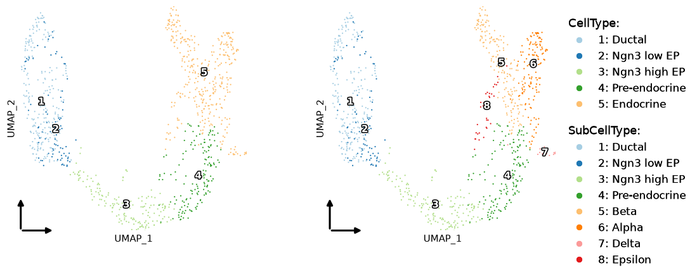

`split_by` keeps **all** cells in every panel, drawing the ones outside the
current split in `bg_color`, so panels stay visually comparable:

```python
scp.pl.cell_dim_plot(
    adata, "SubCellType", split_by="Phase",
    label=True, theme=scp.theme_blank(), ncol=3,
)
```

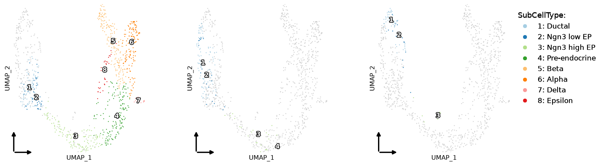

Continuous features. Draw order is ascending value with background first, so the
highest expressers land on top, and the colour scale is winsorised at the 99th
percentile rather than clipped:

```python
scp.pl.feature_dim_plot(
    adata, ["Sox9", "Neurog3", "Fev", "Rbp4"],
    ncol=4, theme=scp.theme_blank(),
)
```

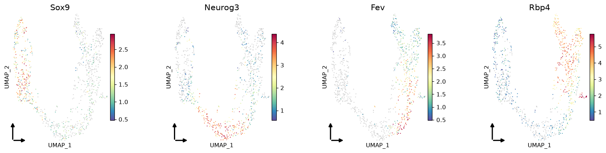

`compare_features=True` gives each feature a two-stop ramp and blends per cell,
so co-expression reads directly off the colour:

```python
scp.pl.feature_dim_plot(
    adata, ["Ins1", "Gcg"],
    compare_features=True, theme=scp.theme_blank(),
)
```

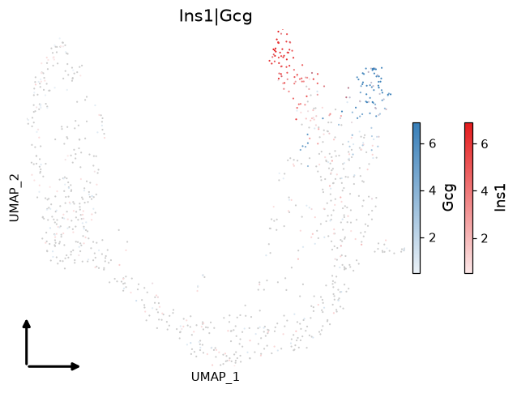

### Heatmaps

The dot form: colour carries scaled expression, dot area carries the fraction of
cells above `exp_cutoff`. Annotation lanes stack above the body, and the whole
layout is sized in inches so a 5 mm lane is 5 mm on the page.

```python
markers = ["Sox9", "Anxa2", "Neurog3", "Hes6", "Fev", "Neurod1",
           "Rbp4", "Pyy", "Ins1", "Gcg", "Sst", "Ghrl"]

scp.pl.group_heatmap(
    adata, features=markers, group_by="SubCellType", layer="counts",
    cell_annotation=["Phase"], add_dot=True, add_reticle=True,
    show_row_names=True,
)
```

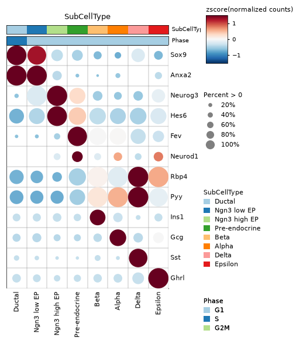

The per-cell form, without aggregation — cells downsampled per group, columns
split so one group's cells touch:

```python
scp.pl.feature_heatmap(
    adata, features=markers, group_by="CellType",
    max_cells=60, show_row_names=True,
)
```

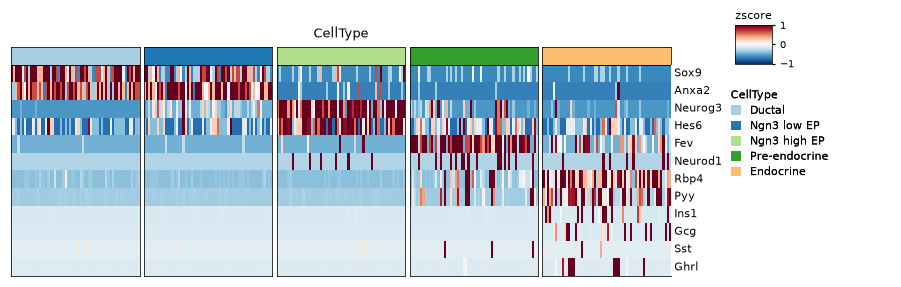

Both return a `HeatmapResult` carrying the figure, the matrices that were
drawn, and a `.spec` you can retune and re-render:

```python
ht = scp.pl.group_heatmap(adata, features=markers, group_by="CellType")
ht.matrices["CellType"].head()      # the z-scored matrix, as a DataFrame
ht.spec.body_height_in = 4.0        # then scp.heatmap.render(ht.spec)
```

### Expression distributions

Five geometries over one grammar — `violin`, `box`, `bar`, `dot`, `col` — with
overlays and the alternating background striping SCP draws by default:

```python
scp.pl.feature_stat_plot(
    adata, ["Ins1", "Gcg"], group_by="CellType", add_box=True, ncol=2,
)
```

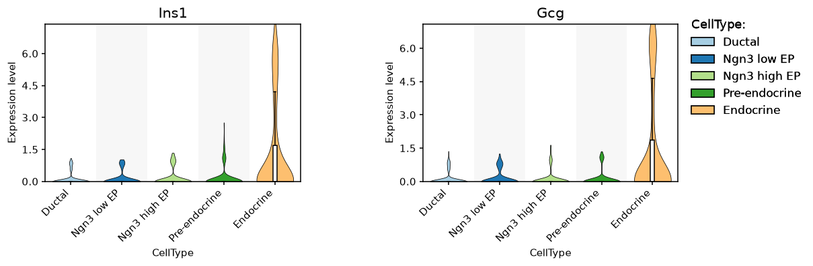

`bg_by` groups the x axis by a coarser variable; `sort` reorders by median:

```python
scp.pl.feature_stat_plot(
    adata, "Ins1", group_by="SubCellType", bg_by="CellType",
    plot_type="box", sort="increasing",
)
```

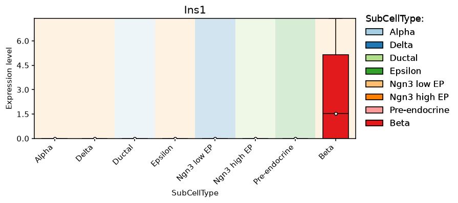

### Cell composition

How one categorical column distributes across another. Nine of SCP's eleven
plot types are available; all are views of the same cross-tab.

```python
scp.pl.cell_stat_plot(adata, "SubCellType", group_by="Phase", plot_type="bar")
```

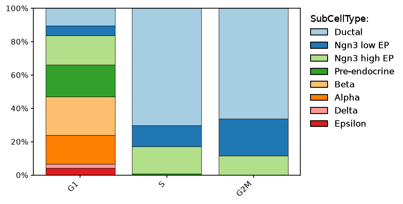

```python
scp.pl.cell_stat_plot(adata, "CellType", group_by="Phase", plot_type="ring")
scp.pl.cell_stat_plot(adata, "SubCellType", group_by="Phase", plot_type="dot")
```

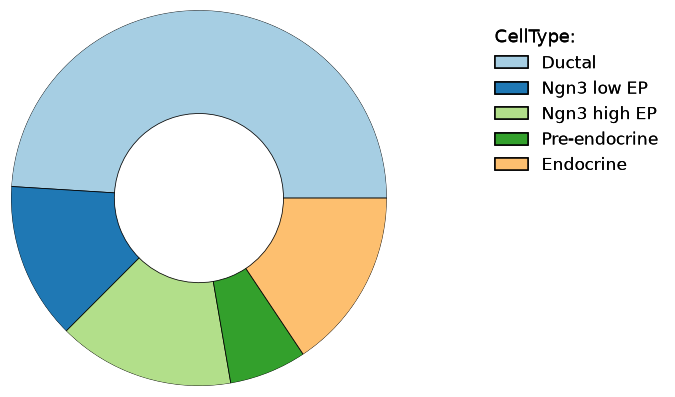 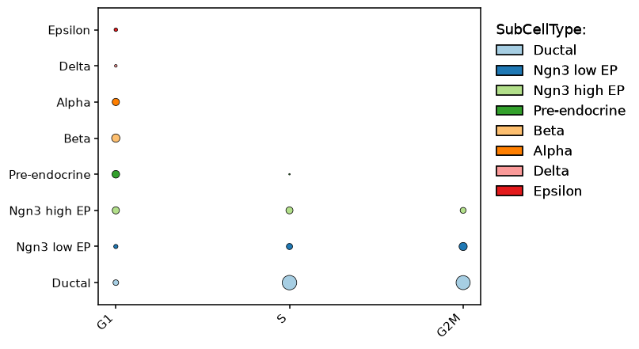

### Differential expression

`volcano_plot` takes a DataFrame, so it works with scanpy's own DE output.
Note the y axis is **signed** — down-regulated genes hang below zero and the
axis is relabelled with `abs()`, so it reads as magnitude in both directions:

```python
sc.tl.rank_genes_groups(adata, "CellType", method="wilcoxon", pts=True)
de = scp.io.de_from_rank_genes_groups(adata)

scp.pl.volcano_plot(de, ncol=3)
```

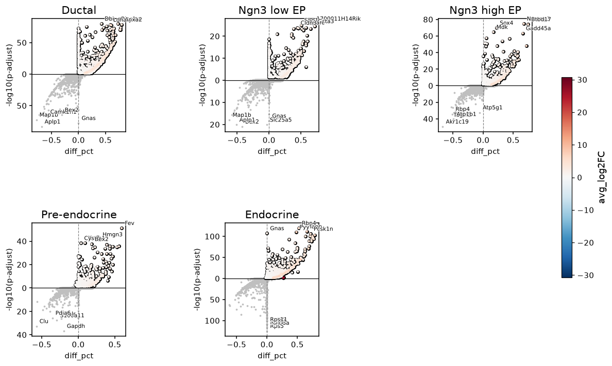

### Correlation

A full scatter-plot matrix — violins on the diagonal, fitted line with r² and
p above, correlation block below:

```python
scp.pl.feature_cor_plot(adata, ["Ins1", "Gcg", "Sst"], group_by="CellType")
```

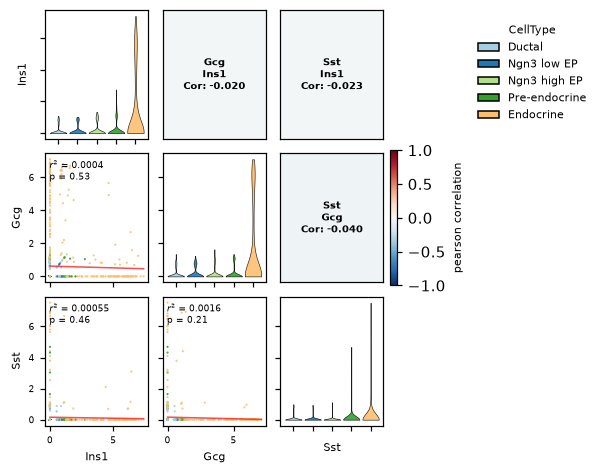

Query-versus-reference similarity, collapsed to group centroids:

```python
scp.pl.cell_cor_heatmap(
    adata, query_group="SubCellType", ref_group="CellType", nfeatures=1000,
)
```

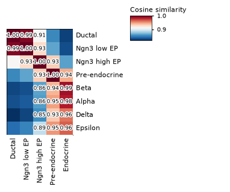

### Trajectory

PAGA read straight from `adata.uns['paga']` — no conversion, since scanpy's keys
are the ones SCP reads. Nodes sit at the per-group **median** of the embedding,
so the same graph can be laid over UMAP, PCA or diffusion coordinates:

```python
sc.pp.neighbors(adata, use_rep="X_pca")
sc.tl.paga(adata, groups="SubCellType")

scp.pl.paga_plot(adata, label=True)
```

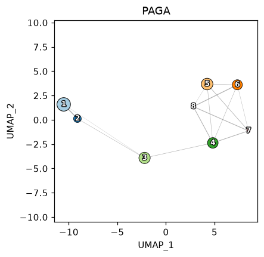

Given a pseudotime in `obs`, the lineage curve and the features along it:

```python
scp.pl.lineage_plot(adata, ["Lineage"])
scp.pl.dynamic_plot(adata, ["Lineage"], ["Sox9", "Neurog3", "Fev", "Ins1"], ncol=4)
```

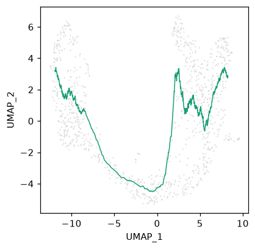

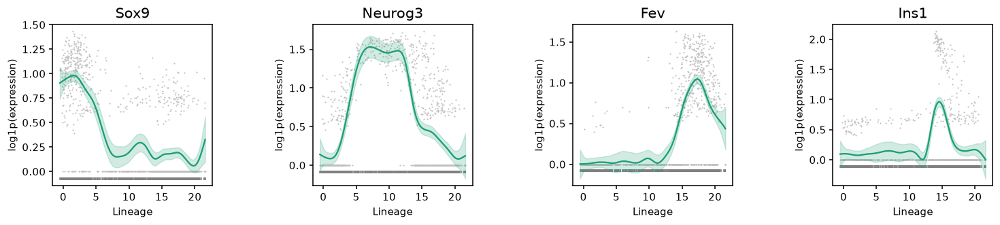

```python
scp.pl.dynamic_heatmap(adata, ["Lineage"], markers, cell_bins=60, show_row_names=True)
scp.pl.cell_density_plot(adata, "Lineage", group_by="SubCellType")
```

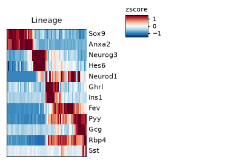 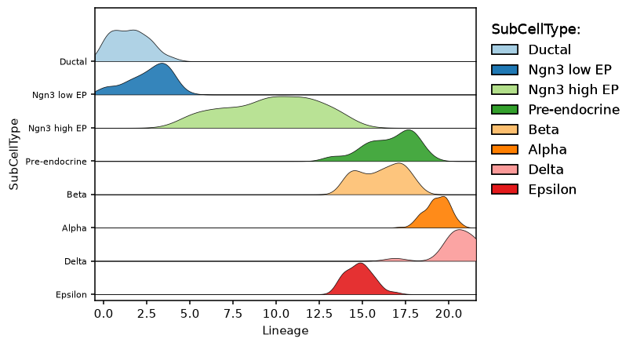

> `dynamic_plot` smooths with `pygam`. That will **not** reproduce R's curve:
> `mgcv` selects its smoothing parameter by GCV/REML and `pygam` does not
> implement that criterion. The trend, the peak position and the ordering of
> features by peak time are stable; the fitted values are not.
> `dynamic_heatmap(use_fitted=True)` raises rather than imply otherwise — the
> binned form shown above needs no fit.

### Enrichment

Enrichment computation stays **out** of the plotting layer: pass a table
matching `scp.io.ENRICHMENT_COLUMNS`, from gseapy, decoupler, or built by hand.

```python
scp.pl.enrichment_plot(enrichment_df, plot_type="lollipop")
```

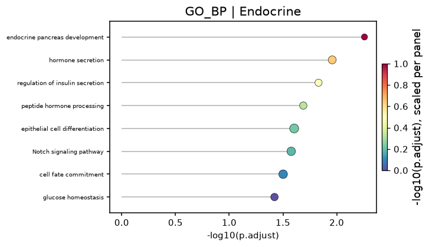

```python
curve = scp.pl.gsea_scores(ranked_genes, gene_set)
scp.pl.gsea_plot({"table": gsea_table, "curves": {"GS1": curve}})
```

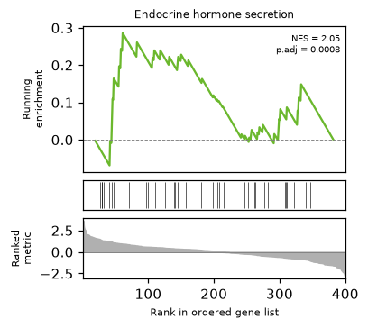

### Palettes and themes

229 palettes, extracted from SCP's own `.rda`. The rule that matters: when you
ask for *n* colours and the palette has at least *n*, you get the first *n*
**verbatim** — no interpolation, so categorical figures stay stable.

```python
scp.list_palettes()                          # 229 names
scp.discrete_palette(["A", "B", "C"], "Paired")
scp.continuous_palette(palette="Spectral", n=100)
scp.blendcolors(["#FF0000", "#00FF00"], "screen")
```

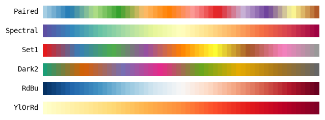

Two themes, passed as objects rather than strings:

```python
scp.theme_scp(aspect_ratio=1)                # framed panel, ticks, no axis line
scp.theme_blank(add_coord=True)              # the published-UMAP idiom
```

## The data layer

Everything funnels through one resolver, which is what keeps behaviour
consistent across figures:

```python
scp.fetch_data(adata, ["Ins1", "CellType", "UMAP_1"])   # genes, obs, embeddings
scp.default_reduction(adata)                             # -> "X_umap"
scp.matrix_process(M, "zscore")                          # ddof=1, matching R's scale()
```

Names resolve genes first, then `obs`, then embedding coordinates; unresolvable
names warn and drop rather than raise; categorical level order is preserved
exactly as declared, because that order drives every palette index, legend
position and facet order downstream.

## Status

The first pass over the whole layer is complete: 27 of the 28 functions in
`scp.pl` are implemented. Options that are not ported raise
`NotImplementedError` naming the section of the porting brief that specifies
them — see the table at the end of [`docs/07_milestones.md`](docs/07_milestones.md).

This is pre-alpha: signatures may still move, and the package has not been
released to PyPI.

## Documentation

| | |
|---|---|
| [Overview](docs/00_overview.md) | what this is, decisions already made |
| [Architecture](docs/01_architecture.md) | the draw-into-axes inversion, sizing, legends |
| [Data contract](docs/02_data_contract.md) | Seurat → AnnData, `fetch_data`, gotchas |
| [Theme & palette](docs/03_theme_and_palette.md) | why the color layer looks the way it does |
| [API mapping](docs/04_api_mapping.md) | every R function → its Python name and status |
| [Porting briefs](docs/porting_briefs/) | per-family implementation detail |
| [Testing](docs/06_testing.md) | golden fixtures over image diffs |
| [Milestones](docs/07_milestones.md) | work plan, and what is deliberately unported |
| [Agent handoff](docs/08_agent_handoff.md) | start here to contribute |

`notebooks/01_parity_foundation.ipynb` runs this package and R SCP side by side
on the same cells and compares the numbers they produce. It is a development
tool — used to find bugs while porting, not a claim about the package — and it
needs a working R install with SCP to execute.

## Credit and licence

All design credit belongs to **Hao Zhang** and the SCP authors. This is a
derivative work of SCP's plotting layer and is licensed **GPL-3.0-or-later**,
as SCP is.

If you use it, cite SCP: <https://github.com/zhanghao-njmu/SCP>

The bundled `pancreas_sub` dataset is redistributed from SCP under the same
licence; it originates from [Bastidas-Ponce et al.
(2019)](https://doi.org/10.1242/dev.173849).
